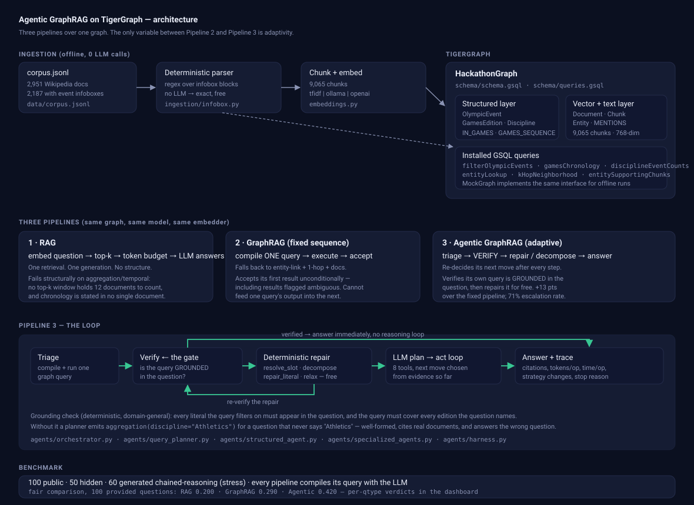

# Architecture



This document explains *why* the system is shaped the way it is. The README
covers how to run it.

---

## 1. The experiment design

The hackathon's question is not "can we build an agent" but "**when does an
agent earn its cost**". That is a causal question, so the benchmark is built as
a controlled comparison rather than three separately-tuned systems.

Held constant across all three pipelines:

- the same graph (same vertices, same edges, same backend)
- the same LLM and the same model id
- the same embedder and the same chunk store
- the same query executor and the same exact-match scorer

The single independent variable between Pipeline 2 and Pipeline 3 is
**adaptivity**: whether the system may change what it does based on what it
found. If the pipelines also differed in retrieval quality or prompt quality,
any accuracy gap would be unattributable, and the headline finding would be
worthless.

This is also why Pipeline 1 (RAG) is built as a *fair* opponent — `k=8`, a good
prompt, the same embedder — rather than a strawman. The claim we want to support
is "RAG fails on these questions **structurally**", and that claim is only
credible if the baseline was given a real chance first.

---

## 2. Data model

The corpus is 2,951 Wikipedia documents. 2,187 of them carry an
`[Infobox Olympic event]` block with a strikingly regular field set:
competitors, nations, venue, date, gold/silver/bronze plus NOC, previous and
next edition.

That regularity is the whole opportunity. Those fields are exactly what the
evaluation questions probe, so they are extracted into a **structured graph
layer** rather than left as prose for vector search to stumble over:

```
OlympicEvent ──IN_GAMES──▶ GamesEdition ──GAMES_SEQUENCE──▶ GamesEdition
     │
     └────IN_DISCIPLINE──▶ Discipline

Document ──HAS_CHUNK──▶ Chunk ──MENTIONS──▶ Entity ──RELATED_TO──▶ Entity
```

Extraction is **pure regex, zero LLM calls** (`src/ingestion/infobox.py`).
This is not a shortcut, it is the correct engineering choice: asking an LLM to
extract structured facts from 2,951 documents (~5.5M tokens) would cost real
money, take hours, and be *less* accurate than parsing a field whose format is
already fixed. The LLM's job is understanding the question, not re-reading data
we can parse exactly.

### Why the *_search mirror attributes

`OlympicEvent` carries `discipline_norm`, `venue_search`, `date_search` and
`event_name_search` alongside the originals. They exist because of a bug that
only appeared once the system ran against a real instance, and which is worth
recording in full because it is the exact failure mode this whole project is
about — a wrong answer that looks completely healthy.

GSQL's `LIKE` is case-sensitive *and* plain substring containment. The Python
backend matches case-insensitively on **word boundaries**. So for the question
"who won the men's 20 kilometres walk…", the GSQL filter
`event_name LIKE '%men''s 20 kilometres walk%'` also matched **"WOmen's 20
kilometres walk"** — because "wo·men's" contains "men's". The query succeeded,
returned a real event, cited a real document, and named the wrong medallist.
Four of the 100 public questions were silently wrong on TigerGraph while the
in-memory backend got them right: 95/100 backend agreement.

The fix is not a cleverer `LIKE`. It is to make sure matching has exactly **one
definition**: `infobox.search_key()` normalizes a string and pads it with
spaces, the loader writes those padded values into the `*_search` columns, and
the client pads the needle identically before sending it. Padded containment is
word-boundary matching, so `LIKE` inherits the correct semantics, and the two
backends now agree by construction rather than by coincidence. Agreement went to
99/100 and TigerGraph to 100/100. `tests/test_core.py` pins the men's/women's
and `+80 kg`/`80 kg` cases against `contains_phrase` so they cannot drift apart
again.

---

## 3. Backends behind one interface

`BaseGraph` declares the contract; `RealGraph` (pyTigerGraph) and `MockGraph`
(in-memory) both implement it.

This was originally not the case, and the consequence was a genuine bug: the
pipelines reached into `graph.store["chunks"]` directly, which only `MockGraph`
has. The moment you pointed the system at a real TigerGraph instance, RAG and
similarity search silently returned **zero results** — no exception, no warning,
just quietly empty retrieval and a benchmark that looked like it ran.

`tests/test_core.py::test_backends_expose_the_same_interface` exists to stop
that class of bug returning.

Backend selection is loud by design (`get_graph`). A run that quietly fell back
off TigerGraph would produce numbers that look fine and mean nothing, so the
fallback always prints why.

### Savanna vs Community Edition

Two differences, both handled in `RealGraph.__init__`: Savanna terminates TLS on
443 and needs `tgCloud=True`; Community Edition exposes RESTPP on 9000 and GSQL
on 14240 over plain HTTP. Everything above that line is identical.

### Bulk loading

Ingestion writes ~2,200 events, ~2,950 documents and ~9,000 chunks. One vertex
per HTTP round trip would be ~14,000 requests, so all writes go through
`upsertVertices`/`upsertEdges` in blocks.

---

## 4. Query compilation

`src/agents/query_planner.py` compiles a natural-language question into a query
spec. Two tiers, and the distinction between them is reported honestly:

**Tier 1 — regex.** Zero tokens, microseconds, covers this dataset's templated
phrasings. The original version of this project was *only* this, scored 100% on
the public set, and generalised to nothing — the regexes were shaped around the
public set's own question templates. That is eval-fitting, not graph reasoning.

**Tier 2 — LLM compiler.** The general path. Takes the question plus the live
graph schema (real discipline names, real games ids) and emits the same spec
shape.

Every spec carries `_planner: "regex" | "llm" | "none"`, surfaced in the
dashboard as *planner provenance*. `--ablation` disables tier 1 entirely so the
system's true un-cached accuracy is measurable. **The ablation numbers are the
honest ones**; tier 1 is a cache, and the repo says so everywhere rather than
quietly banking its accuracy.

### Executor

`src/agents/structured_agent.py` runs a spec against the graph. Counting,
argmax and chronology walks happen in the graph layer, **exactly** — no
generation is involved in the computation itself. An LLM asked to count twelve
competitor numbers out of retrieved text gets it wrong often enough to matter;
a `COUNT` does not.

A query that matches nothing returns `answer: None`, never `0` or `""`. That
distinction is load-bearing: `None` means "keep investigating", whereas a `0`
would be read downstream as a real answer.

---

## 5. The agentic loop, and the part that actually matters

### Triage first

A free deterministic attempt runs before anything is spent. If it resolves and
**passes verification**, the agent answers immediately for zero reasoning
tokens. The `escalated` flag records which questions needed more — and that flag
is the raw material for the hackathon's headline question.

### Verification is a grounding check, not a validity check

This is the core idea of the submission.

Given *"in the discipline that held the most events at the 2004 Summer Olympics,
how many of its events had more than 41 competitors?"*, a planner emits:

```json
{"type": "aggregation", "discipline": "Athletics",
 "games_id": "2004-summer", "min_competitors": 42}
```

Now look at what a conventional verifier sees. The query is well-formed. It
executes. It returns 18 real rows. It cites 18 real documents. Its answer is a
plausible integer. Every structural check passes — and the answer is wrong,
because `"Athletics"` was **guessed** (the question never says it) and `42` is
not the number the question asked about.

Worse, the failure is invisible in the output. On a counting question, an
off-by-one threshold or a wrong discipline produces a number that looks exactly
like a right number.

So the verifier asks a different question — *is this query grounded in what was
actually asked?* — via two deterministic rules:

1. **Literal grounding.** Every string and number the query filters on must
   appear in the question. If it does not, the planner supplied it rather than
   read it, which means the question's real subject was a referring expression
   ("the discipline that...") that has to be resolved by a prior query.
2. **Constraint coverage.** If the question names more distinct editions than
   the query consumed, one query is covering only part of the question — the
   signature of a comparison needing two sub-queries.

Neither rule inspects question phrasing, so neither is fitted to this dataset.
Both cost zero tokens.

### The diagnostic is what makes repair deterministic

The grounding check does not just say "this failed" — it says *which slot* was
unresolved and *why*. That is enough to repair three whole failure classes with
no reasoning at all:

| Diagnostic | Repair | Cost |
|---|---|---|
| discipline guessed, query scoped to an edition | resolve it from the graph via a count-per-discipline argmax, substitute, re-run | 0 tokens |
| question names N editions, query used fewer | re-run the same query once per edition, then compare | 0 tokens |
| numeric threshold absent from the question | substitute the only threshold the question actually states | 0 tokens |

Repairs chain (a resolved discipline with a still-misread threshold triggers the
next repair) and every repaired result is **re-verified** like any other, so a
bad repair escalates rather than being trusted.

Anything outside these three classes falls through to the LLM plan→act loop.

This design decision is deliberate and worth stating plainly: correctness on
chained questions does **not** depend on model strength. Measured with a local
llama3:8b, the model reliably fails to decompose — it echoes the original
question back as its "sub-question". The deterministic repairs exist precisely
so that the hard part (knowing what is missing) is solved by a rule, and the
model is only asked to do what it is good at.

### The adaptive loop

For everything else: plan → act → evaluate, with eight tools (graph query,
relax, vector search, entity linking, traversal, document retrieval, multi-hop
reasoning, answer). The escalation reason is passed into the planner prompt, so
the model is told exactly what the cheap attempt got wrong instead of starting
blind.

One subtle bug worth recording, because it made the agent look competent while
doing nothing: the sufficiency check was originally keyed to `state.step_count`,
which also counts the triage query and its verification. It therefore fired
*immediately after triage*, before the agent had taken a single corrective
action — and a small model asked "is this evidence sufficient?" answers "yes,
confidence 1.0" about the very evidence that had just failed verification. The
agent stopped, having done nothing, with a clean-looking trace. Sufficiency is
now gated on `loop_actions`, which counts only work done inside the loop.

### Stopping criteria

Every stop records when and why: verified-and-resolved, repaired
deterministically, agent judged evidence sufficient, max steps, or token budget.
These appear aggregated in the dashboard.

---

## 6. Two experiments, and why both were needed

### 6a. The provided set, measured fairly

The first version of this benchmark used a regex question-parser by default.
It resolved the provided set's templated phrasings for zero tokens, GraphRAG
and Agentic both scored 100/100, and the conclusion was "on this set the agent
is not worth its cost".

That conclusion was an artifact. The regex parser is only free because it
**encodes prior knowledge of the question templates** — a prior the RAG
baseline is never given. The comparison was between a pre-tuned system and an
untuned one.

With the fast path off and every pipeline compiling its query with the same
LLM, the result **reverses**:

| Pipeline | Accuracy | Avg tokens | Tokens / correct |
|---|---|---|---|
| RAG | 0.200 | 2,764 | 13,820 |
| GraphRAG | 0.290 | 985 | 3,396 |
| Agentic GraphRAG | **0.420** | 3,795 | 9,057 |

The agent wins by 13.0 points, and escalates on 71% of questions. The reason is
visible in the per-type breakdown: `llama3` is a poor NL→query compiler. It
emits `superlative` where `aggregation` was meant, invents disciplines the
question never names, and misreads numeric thresholds. GraphRAG accepts those
queries and returns confidently wrong answers. The agent's grounding check
catches them.

The sharpest single number is `aggregation`: **0.62 → 0.91 for two extra
tokens**. The planner compiles "more than 41 competitors" as
`min_competitors: 42`; the grounding check notices 42 is not a number the
question contains, and a deterministic repair substitutes the one that is. No
LLM call, no reasoning — a rule, applied to a diagnostic.

`lookup` runs the other way: **RAG 0.79 against the graph pipelines' 0.37 and
0.44**. Single-document fact retrieval is what vector search is for, and our
planner fumbles exact title resolution. That result bounds the claim honestly —
graph structure helps with counting, chronology and comparison, not with
finding one fact in one document.

`superlative` shows the agent adding nothing at all (0.10 both). When a planner
failure produces a *plausible* query — an argmax over the wrong set — there is
no diagnostic for the grounding check to fire on, so there is nothing to
repair. That is the boundary of the technique.

### 6b. The stress set, because the provided set has a ceiling

Even measured fairly, the provided questions are single-hop. They cannot show
whether an agent can do something a fixed pipeline *structurally cannot*, as
opposed to doing the same thing more reliably.

So `src/eval/stress_set.py` generates 60 harder questions on the same corpus,
where the discriminating variable is precisely the capability Pipeline 2 lacks:
feeding one query's output into the next. Every question has the shape "resolve
X, then query using X", where X is never stated.

Gold answers are computed directly from the structured graph at generation time
— correct by construction, no LLM in the labelling path, seeded and
reproducible. Ambiguous cases (tied superlatives) are skipped rather than
labelled, because an ambiguous question cannot be graded.

Measured fairly — every pipeline compiling with the same LLM — fixed GraphRAG
scores **0.100** against the agent's **0.450**, and is *more* expensive per
correct answer (9,229 tokens vs 6,950). With the regex planner alone it scores
**0/60**. The few it gets come from the planner guessing the
unstated value correctly — luck, not capability, and the grounding check flags
exactly those queries as ungrounded. This is not a tuning gap to be closed with
a better prompt; it is an expressiveness gap, because one compiled query has
nowhere to put the result of another.

### What the two experiments say together

Adaptivity pays under two conditions, and the provided set only exercises the
first:

1. **The planner is unreliable enough that its output needs checking.** Common
   with small or cheap models — exactly when you would want an agent.
2. **The question needs the output of one query as the input to the next.** No
   fixed pipeline can express this at any model quality.

## 7. Token accounting

The rubric asks for context tokens, input tokens, output tokens and totals, per
operation and per answer. `UsageTracker` records every call with its tag, model,
latency and token split, so `results.json` supports "tokens per operation" and
"time per operation" directly rather than requiring a reader to infer them.

Two details that matter for honesty:

- **Context tokens are measured separately** from total input tokens, so the
  retrieved-evidence cost is distinguishable from instruction overhead.
- **A provider that omits usage gets a tiktoken estimate, flagged
  `estimated: true`** — never a silent zero. A zero would quietly understate a
  pipeline's cost and corrupt exactly the comparison the rubric weights at 15%.

---

## 8. Known limitations

- The public-set result is a ceiling effect. The dashboard says "AGENT NOT WORTH
  IT" for those question types, and that is the correct read.
- Deterministic repair covers three failure classes, not all of them. The rest
  depends on the LLM loop, which is only as good as the model behind it.
- The `Entity`/`RELATED_TO` layer is sparsely populated, so the generic
  entity-linking fallback is weaker than the structured path. Questions outside
  the Olympic-event schema rely on vector search.
- **Vector ranking runs client-side, not in GSQL.** The original plan was a
  `chunkVectorSearch` query computing cosine over `Chunk.embedding`. It does not
  compile: GSQL rejects *every* method call on a `LIST` parameter, so a query
  taking the query vector as `LIST<DOUBLE>` cannot index into it. Rather than
  ship a draft query with a type error, it was removed and the limitation
  documented. TigerGraph 4.2+ native `VECTOR` attributes are the real answer and
  need dense embeddings.
- TF-IDF embeddings are sparse and cannot be stored in a `LIST<DOUBLE>`.
  Ingestion warns and writes chunks without embeddings rather than failing
  silently; use `EMBEDDING_PROVIDER=ollama` for vector search inside TigerGraph.
